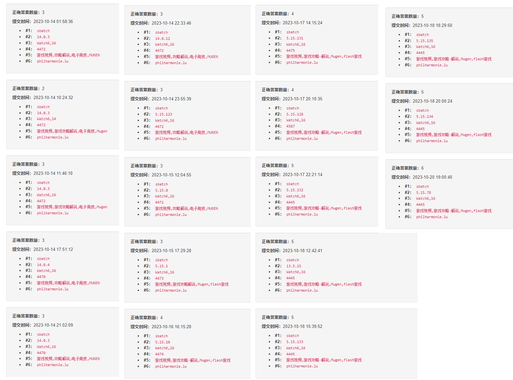
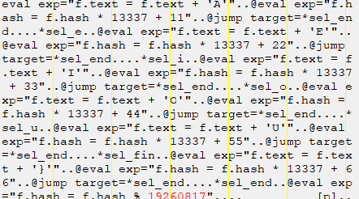

# 3rd PKU Geek Game Writeup
## 前言
这一周（从2023.10.13到2023.10.20） 除了写线代作业高数作业计概作业以及刷微信之外的几乎所有时间都用在了这上面，导致它结束了之后我甚至产生了不知道该干什么了的感觉（当然是捡起被抛在脑后的高数和线代）<br>
所以说感觉应该写点什么纪念一下，让多年之后的我看到的时候能感慨一下当年怎么这么菜，然后就有了这样一篇题解和日记的杂交产物（还专门去学习了一下markdown的语法）<br>
最后的成果：<br>
<br>
<br>
<br>
总结就是，对web一窍不通，基础知识差太多了，只有misc和binary能做，algorithm要不然连题都看不懂，（特指关键词过滤喵，谢谢喵，不知道是我语文不好还是出题人的问题，但是过的人这么多，应该是我的问题吧），要不然没来得及做

---

## 一眼盯帧
这是连我都觉得没什么好说的签到题，比前两年的简单多了<br>
附件下载下来，使用potplayer(甚至sumatra pdf都行)打开，然后把每帧的字母拼起来，得到

> synt{trrxtnzrgurguveq

一眼凯撒，可以直接算一下s和f的差值，发现是13，然后网上随便搜个工具或者自己写个脚本都可以得到：

> flag{geekgamethethird

## 小北问答
这个题……消耗了我十分巨量的时间，并且到最后也没做出来，直接导致我前两天的精神状态非常不佳

1.第一题倒是很简单
搜索“北京大学（校级）高性能计算平台”，得到官网[https://hpc.pku.edu.cn/](https://hpc.pku.edu.cn/)，点击使用指南-上机流程-提交作业，第一个sbatch就是

btw,之前没用过正则表达式，做这题的时候还特意去学了一下^匹配字符串开始，$匹配字符串结尾，[a-z]匹配中括号里范围的任意字符，+表示前面的字符可以有任意个

2.然后就是万恶的第二题，我卡在这卡了好久好久，直到最后也没有做出来

一开始搜到了wiki，上面写着K60 Ultra的内核版本号是4.0.3，然后就直接填上了。后来经过了多次尝试，发现这个填的不对，然后搜到了一个下载最新固件的？网站[https://xiaomifirmwareupdater.com/firmware/corot/](https://xiaomifirmwareupdater.com/firmware/corot/)，发现最新的是4.0.12。但是还是不对，然后突然灵光一闪，又回去读题，发现题目问的可能是linux kernel的版本而不是MIUI的版本。（我前后加起来至少仔细看了这个题干十遍）

 然后就开始了新的漫长的故事，我到处搜K60 Ultra linux kernel version，尝试了new bing，尝试了gpt的web browsing，但是全都找不到答案，过程中搜到了github上的MIUI的源代码[https://github.com/MiCode/Xiaomi_Kernel_OpenSource/tree/corot-t-oss](https://github.com/MiCode/Xiaomi_Kernel_OpenSource/tree/corot-t-oss)然后由于缺乏软件工程（应该是吧）的常识，并不知道该上哪去找linux的版本号。然后四处乱看，在某一个commit里面看到了merge Android13-5.15，然后我就知道了这个内核的android版本，然后我又到处去找Anroid13-5.15对应的linux内核版本，又搜了好久好久，还是哪都搜不到，然后询问了gwq（违反规则*1）gwq告诉我，5.15就是linux kernel的version。。。。。。觉得自己真是蠢爆了。但是，第三个数字要从哪找呢，还是不知道。期间还问了gpt，至少两次，gpt告诉我，可以去kernel目录下的Makefile里找，前三行就是版本号。然而，kernel目录下的Makefile里并没有这三行。然后还好几次搜到了Android build的一个网站(找不到了），上面大概写着13对应的最新linux kernel是5.15，然后15后面的数字，每当linux kernel发布lts之后会尽快更新。然后既然我在MIUI那里找不到对应的linux kernel version，就去找了linux的最新lts，但还是哪里都搜不到。。最后的最后搜到了这个[https://git.kernel.org/pub/scm/linux/kernel/git/stable/linux.git/commit/?h=linux-5.15.y](https://git.kernel.org/pub/scm/linux/kernel/git/stable/linux.git/commit/?h=linux-5.15.y)（昨天晚上竟然又发了一个更新，我看的时候最新还是5.15.135，然后我就把这个交上去了，但还是错了
期间应该还有很多很多别的尝试，但是记不得了（x
真的很痛！
然后在比赛结束之后，在QQ群里看到，原来答案就在根目录下的Makefile里。。。。<br>
5.15.78
好好好，想死的心都有了（x 88分！算了，分数不重要 [peace]

3.这道题也很简单，直接搜就搜到了，懒得再找了

4.这题也花了许多时间，但总的来说，还是，可以接受的，和第二题相比<br>
第一天晚上应该由此题和第五题贡献了绝大部分的崩溃<br>
一开始应该尝试去搜了一下，显然搜不到，然后还去尝试了一下自己改名，然后把键盘上的符号全都试了一遍，没一个禁用的（我还非常愚蠢的一个一个试，后来才发现可以一次试好多个（x
然后呢，比赛平台是开源的，那就去翻一下它的源代码吧

由于我看不懂javascript(x，并且这种逻辑显然应该在后端里，所以一开始翻了半天后端

突然恍然大悟，我为什么要去回忆这么详细的细节，差不多得了（x

总而言之，就是一开始翻了半天backend，但是找错地方了，然后在frontend里面发现了一个叫wish的请求？然后顺着找到了backend里的store里面的user_profile_store，然后发现了这个部分期间应该还请教了很多次gpt帮忙看代码。感觉这次还是有挺多运气成分的，好几次不知道为什么反正就是找到了地方（比如绿色汉化版的flag2<br>
然后就直接复制，然后运行，需要pip install unicategories，然后得到4472，但是输进去时候好像不对，发现补充说明里说跟python版本有关，那就得等之后换python版本慢慢试了，但是当时在家里，家里电脑上没有anaconda，所以作罢，后来拿笔记本试了一下（噢不，在此之前还尝试在台式上装mamba来着（因为conda的solving实在是太折磨人了），但是没有成功，每次mamba activate都跟我说要mamba init，但是明明我已经init过了，到现在也没有解决），试了3.10和3.11，但是都不对，然后心想总不会比3.9还老吧，但是还是试了3.8，得到4445，发现是对的（这个过程应该持续了非常多天）

5.这题……唉

第一天晚上的大部分时间应该都在跟它作斗争，主要原因可能是archive.org的服务器显然不太好，而我的梯子也不太好用，然后很多时间就浪费在了等它加载然后心想怎么还不出来上
archive.org上搜bilibili.com，2011年应该只有两个archive，并且都打不开，会显示directory listed denied，然后搜了半天这个是什么意思，最后得出结论并不是我的网的问题，是它爬下来存起来的时候就有问题（现在挺确定的，但是当时不知道啊，当时真的跟它拉扯了半天，就是在你觉得你做的非常正确，但是结果显示你就是错了，然后你不知道为什么错了，然后反复的在重复同样的无意义的行为的时候，就是最痛苦的）然后应该去尝试了很多别的网站，也找了这个网站比较靠后的archive，然后应该是得到了一些答案，但是显然都是错误的。当时看2013的archive好像就会被重定向到bilibili.tv，当时以为是b站的电视频道之类的东西，觉得不对，后来搁置了好几天之后，突然有一天去搜bilibili的wiki，应该是想看看b站啥时候有的，然后偶然发现b站2011年一开始域名是bilibili.us，后来6月份的时候改成了Bilibili.tv，然后去archive.org上搜，就顺利地得到了答案噢还有一个问题，之前一开始的时候应该是尝试过·，显示格式错误，导致我一直以为不能输·，所以一开始答案还不对，后来又试了一下发现其实可以，不知道第一次出了什么bug

6.这个题倒是意外的顺利，不太符合它的位置（）好像直接谷歌搜图就搜出来了，一开始去搜赞助商的名字，完全无果，然后谷歌搜图，看前几张背景跟这个图里的建筑几乎完全一样，然后就直接得到了答案

最后，强烈谴责给提示只给后三题的行为，明明第二题才是最难的！而且感觉第五题的提示走歪了，完全没必要去搜拜年祭吧，给提示跟b站历史域名有关的才比较靠谱。第六题的提示也完全没有必要，可能是实在不知道该说什么了

附上我多次尝试的历程。。。

刚两道题怎么写这么长。。废话真多

---

决定采用一种很新的写writeup的方法，完全按照时间顺序来写
## Z公司的服务器
这道题同样对我的精神状态造成了不小的伤害 说好的“**连接到服务器即可用这种方法接收Flag1**"呢 为什么我收到的是乱码！ 然后我就是两眼一抹黑，完全不知道应该干什么


然后我应该去问了gpt古老的方法是什么，gpt跟我说可能是FTP，但是显然不是，然后只能作罢

然后当时放出来的题没几道，并且几乎全都是两眼一抹黑，于是只能去看往届的题解，然后意外的发现了，原来.pcapng真的是一种格式，是流量包，可以用wireshark打开，本来以为是出题人随便编的（好蠢

然后就打开了流量包，发现里面有个.jpg，并且有FF DB，所以确实穿了个.jpg，然后就用gpt交给我的，右键，follow TCP stream，然后save as, raw，然后把后缀改成.jpg，但是打不开

然后自己随便画了一个无标题.jpg，然后用010editor打开，噢对，这其中还发现了一个很好用的能看raw的软件，就是010editor，下它的时候还跟windows defender拉扯了半天。回过头来看，其实还是有不小的进步的，（比如说至少知道了一些（很多）软件，知道什么时候该用什么能解决问题，能不两眼一摸黑了）然后发现虽然有FF DB FF E0，但是后面的部分可以说差着十万八千里，还有很多重复的18 40 18 41之类的东西，然后我还去问了gpt，但是它明明知道，但就是不告诉我！太坏了md

总而言之，jpg坏掉了，发现流量包里有一些跟我连到网页环境里收到的**.B00000000之类的东西很像的字符串，但并不能知道是什么，所以只能先作罢了

未完待续

## 基本功

一开始对zip格式几乎没有了解（只知道50 4B 03 04 还是之前高三的时候某个word坏了尝试修的时候知道的， 当时还误入了某个ctf选手的博客，那应该是第一次听说ctf）然后想尝试用010editor打开然后从编码里面找到点什么。但显然是不可能的。然后在搜zip datadescr(某个数据段)的时候发现了一篇博客[https://www.52pojie.cn/thread-1071012-1-1.html](https://www.52pojie.cn/thread-1071012-1-1.html)

其实并没有什么用，但是发现了有一种叫明文攻击的东西，本来我完全忽略了压缩包里的chromedriver，然后突然意识到可以拿这个来明文攻击（什么life is a random walk

chromedriver这个东西我熟悉的很啊（ 高三一直拿这个和selenium爬成绩来着 然后就去那个网站上找相同的版本 本来在一个一个试，然后看CRC值是不是一样，试了好几个都不对 然后发现我可以通过大小来找 然后就很快找到了一个大小完全一样的 然后使用bkcrack 成功获得了3个key 然后就解出了flag1 

在看bkcrack的教程[tutorial](https://github.com/kimci86/bkcrack/blob/master/example/tutorial.md)的时候，其实发现了可以通过猜来明文攻击，12个字节（其中8个连续）就可以，并且在某天睡觉的时候想到了flag2里面的pcapng应该也是可以猜的，但是当时可能比较懒，急着去做别的题，就没有实践，然后就拖到了第二阶段开始之后，然后其实那个提示对我没有任何用处因为我早就知道了可以这么做，但还是白白少了87分，算了，算了分数不重要

总之就是，去搜了一下pcapng的编码格式，然后甚至找到了两篇用pcapng明文攻击的例子，然后就照做就完事了<br><br>

这应该是我第一道完整解出的（除了签到题以外的）题

oh 没有按照时间顺序，但是没关系

update: 赛后突然发现这篇博客的开头有：
>《量子加密》writeup by @xmcp

竟然也是xmcp出的

## 汉化绿色版免费下载
不知道我怎么想的，一开始好像是想逆向看代码来找flag来着，然后被代码长度吓退了，完全没想到用cheat engine搜一下内存

然后还是两眼一抹黑看往年题的时候，发现往年的binary有道非常简单的能直接用cheat engine秒掉，然后正在想今年怎么没有这么简单的题的时候，突然意识到，这题难道不能这么做吗，然后就非常顺利的扫到了flag，这就是第二道做出来的题

然后就不知道该怎么办了，flag的内容好像是did you unpack the xp3，虽然去搜了一下，但是我还是没有认为xp3是一个可以被“解”的东西，然后我好像甚至没有尝试用010editor看一下，就直接跳过下一道了

未完待续

## 初学C语言

记得在比赛开始之前，看[hello ctf](https://ctf.tj.cn)的时候就直接翻到了pwn那一节，然后看了一点基本的栈溢出的内容，然后看到这道题就猜想应该跟这个有关（不过我最后就做出来了flag1 flag1其实也几乎没关） 

一开始不知道printf如果格式化字符串里的%比后面传的参数多的话会发生什么，然后搜到了一个东西说会直接继续把内存上后面的东西给输出出来，然后就大概知道怎么做了

然后应该是想找到flag1和publici在栈上离了多远来着，这个过程大约是需要一个linux系统的，然后我就去配置我军训做csapp data lab的时候就在配的wsl2，当时gcc就用不了因为找不到stdio.h，然后是因为我没装build-essential，但是sudo apt get build-essential就会报错，unmet dependencies，然后如果我想去装其中的一个包，就会弹出好几十条新的unmet dependencies，就完全没法解决，最后就放弃了，当时是下了一个别人做好的docker来解决的，但是现在显然不行

然后经过好几个小时的奋战，到处搜，最后发现问题的根源————我换源的时候应该找的是一篇给ubuntu20.04换源的blog，但是我装的是ubuntu22.04，这俩的源里面的东西是不一样的 ………………真的很无语 总之解决的这个问题，现在我的wsl非常好用(pycharm clion无缝衔接 windows写代码 linux运行)

回到正题。然后我学习了如何命令行用gdb, break, run, p &flag1, p $rsi, etc. 但是printf好像并不像我想象中的那样运行，比如我输入好几个%d，它并不是把连续地址转换成整数输出出来，然后我就很想知道printf内部到底是咋运行的，但是printf没有调试信息，所以默认状态下step会跳过那行，不会进去，然后需要打开一个选项，但是这样之后也没法设断点，我也不知道用什么选项能看汇编（其实这个搜一下应该肯定有的，问gpt也行，但是当时网应该不太好gpt不是很能用） 总之陷入了迷茫之中，然后搜到了一篇博客，主体内容应该关系不大，但是它让我知道了一个叫%p的东西，一直%p就能一直输出连续地址（好像是？ 然后我在本地试了一下flag{在内存里应该是什么值，然后输入了好多%p，然后找到了对应的部分，然后ascii翻译一下就得到了flag

总而言之就是过的不明不白的，应该再好好研究一下

## 绝妙的多项式

那天linux俱乐部的install party上看旁边的人好像在做这道题，旁边的那个人好像也是新生，当时是20名，好强（窥屏不是好习惯

总之给我一种我应该能做出这题的感觉（x 其实确实挺简单的 但是……

使用ida pro打开二进制文件，f5，找到对应的伪代码<br>

然后尝试理解一下。虽然反汇编出来的c++很抽象，但是连懵带猜还是能基本上看懂的。翻译一下就是这样<br>

然后发现虽然题目名叫多项式，但其实就是一个线性方程组，对应的系数矩阵都能写出来（长得很像范德蒙行列式）矩阵打起来太麻烦就不写了，总之高斯消元就能解决（cramer's rule也可以） 有一个比较麻烦的地方就是，这里使用的是modint，就是每次操作之后都模998244353，那么我在高斯消元的时候应该怎么办呢？加法，减法和乘法都不会影响mod运算的结果，但是除法会，所以应该怎么处理除法呢

显然我不知道，并且一开始甚至没有意识到这个问题，消了几行之后才发现。然后请教了占老师（违反规则*2），占老师告诉了我带模除法的正确操作，就是比如说算a/b，那么可以找到b的逆元，逆元就是一个，假如说是b'，满足bb' mod p = 1的数，然后a/b就可以变成a * b'，这样mod p的结果不变，因为假设bb' = kp + 1,那么a * b' = a * (kp + 1) / b = (a / b) * (kp + 1)，mod p的结果还是a / b。然后现在的问题就是要怎么找到这个逆元，假如说p是一个质数，那么在(1,p)中就可以找到唯一的b'，可以使用扩展欧几里得算法，长得很像辗转相除，其中用到了一个叫贝祖定理的东西，我现在也不是很懂（x 但是反正抄来了代码能用（x

最后写了个高斯消元，代码如下

```c++
{
    void exgcd(int a, int b, int& x, int& y) {
    if (b == -1) {
        x = 0, y = 0;
        return;
    }
    exgcd(b, a % b, y, x);
    y -= a / b * x;
}

class modint{
public:
    int num;
    modint operator +(const modint &x) const{
        modint t;
        t.num = this->num + x.num;
        if(t.num >= mod)
            t.num = t.num % mod;
        return t;
    }modint operator -(const modint &x) const{
        modint t;
        t.num = this->num - x.num;
        if(t.num < 0)
            t.num += mod;
        return t;
    }modint operator *(const modint &x) const{
        modint t;
        long long temp;
        temp = (long long)this->num * (long long)x.num;
        temp = temp % (long long) mod;
        t.num = (int) temp;
        return t;
    }modint operator /(const modint &x) const{
        int reverse, y;
        exgcd(x.num, mod, reverse, y);
        if(reverse < 0) reverse += mod;
        long long temp = (long long)reverse * this->num;
        modint t;
        t.num = (int)(temp % (long long) mod);
        return t;
    }
}matrix[maxN + 1][maxN + 1];
modint original_matrix[maxN][maxN];

void elimination(int start, int col){
    int i, j;
    for(i = start + 1; i < n; i++){
        modint dividor = (matrix[i][col] / matrix[start][col]);
        for(j = col; j < n + 1; j++){
            matrix[i][j] = matrix[i][j] - (matrix[start][j] * dividor);
        }
    }
}
void back_substitution(int end, int col){
    int i, j;
    for(i = 0; i < end; i++){
        modint dividor = (matrix[i][col] / matrix[end][col]);
        j = col;
        matrix[i][j] = matrix[i][j] - matrix[end][j] * dividor;
        j = n;
        matrix[i][j] = matrix[i][j] - matrix[end][j] * dividor;
    }
}

void init(){
    int i, j;
    for(i = 0; i < n; i++){
        matrix[i][0].num = 1;
        matrix[i][n].num = b[i];
    }
    for(j = 1; j < n; j++){
        for(i = 0; i < n; i++){
            matrix[i][j] = matrix[i][j - 1] * modint{i + 1};
        }
    }
}

int main(){
    init();
    int i, j;
    for(i = 0; i <= 34; i++){
        elimination(i, i);
        print();
    }
    for(i = 35; i > 0; i--){
        back_substitution(i, i);
        print();
    }
    modint sum{0};
    for(i = 0; i < n; i++){
        modint temp = matrix[i][36] / matrix[i][i];
        cout << temp.num << endl;
        sum = sum + temp;
    }
    cout << sum.num << endl;
}
}
```

然后呢，事情并没有到这里结束，因为，原本的dword_5020是这样展示的：<br>
然后我把它直接复制到了记事本里，然后替换".data:0000000000005020" ""， 替换"dd" ""，但是记事本的替换似乎并不区分大小写，然后我就把后面的两个数字里的DD也替换掉了，但是我当时并没有发现这一点

然后我成功得到了一组解，每个数都有至少六七个数字，显然这并不能通过ascii码变成一个字母，然后我左思右想到底出了什么问题，我先用cramer's rule又算了一遍解，然后发现得到的数跟高斯消元出来的一模一样，这样我比较确定这个带模除法的方法以及我的代码应该是没什么问题的，然后我又反复看了ida pro反汇编出来的伪代码，确认逻辑确实没错，就是这样，还写了一个程序，算了一下我的解经过同样的计算之后能不能得到dword_5020（是我替换后版本的），结果是可以

然后我就百思不得其解，最后只能放弃了（心想：反正我会了，分无所谓

未完待续（看到这里你能感受到我的绝望了吗！

## 麦恩·库拉夫特

哎呀，好像忽略了这道题，其实这个做的应该也很早，不过也没什么可说的

耗费时间最长的部分是下载服务端、客户端，然后把mc跑起来（好几年没玩过mc了，对mc的记忆还停留在1.8 当时1.11应该已经是最新的了 结果现在这个存档都是1.18的了 好有岁月之感 我也是个老人了（x

然后呢，就一通乱找，中途误入了漆黑小道，实在看不清，然后把显示器亮度调到最高，然后如履平地（x 然后就很顺利地找到了第一个flag 然后就没再试了

结束之后看群里有人说直接存档里就看见flag了，我：啊？ （好蠢

## Dark Room

这道题其实也是做的比较早的（可能是看起来比较能入手吧

先发现了flag room，然后应该是偶然输入了字母？ 然后就看见了traceback<br>

我认为这么低级的错误肯定是故意放出来的，所以这大概就是突破口

但是然后呢？ 然后呢？ 不知道了 然后就不知道了

flag1应该就是正常的通关，sanity >117%就可以，当时一直在想题干里的”破坏规则“是怎么回事，然后去看了题干里给的那个源码，但是显然没什么收获，（如果有连我都能看得出来的bug，那应该早就被修了吧） 然后看到了help有20%的几率+sanity，所以想到的唯一方法就是，多help几次拼概率？ 二阶段给的提示也确实是这个 其实如果写个脚本自动化的话应该也能过吧，但是不知道怎么写（x 其实知道 所以就是懒得写 而且不确定能过？ 等会去试试

## 华维码

这道也是伤害我感情的烂题（x

周末花了好多时间搞它，拿word（好原始的工具）切成一块块的然后拼起来 根据搜到了二维码编码规则 当时就知道三个角的定位，然后右下的小alignment pattern，然后两根时序线，好像还有那个dark module，（还从syy那些学到了华容道技巧（我好蠢）） 但是有太多块不确定了，然后并不是每一种都能成功的完成华容道的，然后就不知道怎么办了

由于不停的试显然需要过多操作，不太现实，然后就放弃了

后来看到了二阶段的提示，然后发现还有一个format information的区域，需要满足两条线上的信息能按顺序对应，发现一开始有个地方拼错了。但是没用，还是有太多块不确定了

遂放弃

## Emoji Wordle

这道和华维码一样，浪费时间伤害感情（x

周三的德法课上的几乎所有时间好像都贡献给了这道题，而且非常的愚蠢，甚至懒得写脚本， 是一个一个手动试的 （可能也是因为觉得c必然不支持这么现代的编码，python又不太会用（草） 

然后试了半天，觉得我已经穷尽了所有可能了，但是它就是不对，然后陷入了同样的绝望状态

---
一阶段做出来了的题和做出的尝试好像都说完了，然后就进入二阶段


## Z公司的服务器

第二阶段最有用的提示应该就是这个了，给了dockerfile，安装了lrzsz这个包，查一下发现这个包是用Zmodem协议来收发文件的，提示还说有些工具对此协议的支持存在bug。所以为什么明知道网页终端或者nc都没法用这个协议的情况下萌新教学还是让用这些啊！

然后装了lrzsz包，按照gpt的指示，使用nc prob05.geekgame.pku.edu.cn 10005 | rz， 但是好像还是不行，为什么捏，不知道

然后按照搜到的好多博客的方法，装了一个secureCRT，然后成功接受了flag1

然后提示还给了Zmodem协议的文档，但是官方文档太难读了，于是再去搜博客，然后把搜到的东西和pcapng里的进行对比，是差不多的，但是又有些不对劲

然后经过了漫长的时间，许多重复无用操作，结合传输开头的那一行里说这个文件有16000字节左右，但是得到的这个东西有20KB，应该是有一些多余的东西的，最终猜测原本的00应该被替换成了18 40，以此类推，18 41对应01， …… 然后就在010editor里替换试了一下，发现现在那个jpg文件确实比较像我自己画的那个无标题.jpg了 然后发现需要替换的不止18 4开头的，上到18 C2都有，这样手动替换就太麻烦了，就用python写了个脚本把18之后都替换掉了，（这个过程也利用了gpt的指示(不太知道怎么处理byte类的东西），gpt真的救我狗命，虽然gpt写人话写不太出来，但写程序还是不错的），然后获得了一张图片
脚本：
```python
with open("raw_data", "rb") as f:
    data = f.read()

output = bytearray()
i = 0
while i < len(data):
    if data[i] == 0x18 and i + 1 < len(data):
        output.append(data[i+1] - 0x40)
        i += 1
    i += 1

with open("this", "wb") as f:
    f.write(output)
```
得到：<br>
然而这张图片好像不是特别能辨认的出来是什么，发到微信（违反规则*3）之后，xxx说不同设备看的效果不一样，然后我就意识到大概是有什么问题的，正好博客里说每1024字节会有6字节的Zmodem的数据，所以应该把这些剔除出去，然后发现这6字节的开头是ZDLE(0x18)，所以替换0x18的时候应该把这部分保留，所以修改了一下脚本
```python
with open("raw_data", "rb") as f:
    data = f.read()

output = bytearray()
i = 0
cnt = 0
while i < len(data):
    if data[i] == 0x18 and i + 1 < len(data) and cnt < 1024:
        output.append(data[i+1] - 0x40)
        i += 2
    else:
        output.append(data[i])
        i += 1
    cnt += 1
    if cnt == 1024:
        i += 6
        cnt = 0

with open("this", "wb") as f:
    f.write(output)
```
得到：<br>
这个虽然有遮挡，但是也能看出来了（其实如果足够了解jpg编码应该可以把下面的黑块去掉？？）事后来看其实上面那张图也可以提供一点提示？比如说能看出一个y的下半部分，所以Na1和5中间那个应该是y？但是这谁看的出来啊

然后又把这张图发到了群里（违反规则*4）然后wxc大佬通过高超的英语水平猜出了第二个单词是analysis，然后我恍然大悟最后一个单词是ZMODEM，然后就这样解决了

这是第二道完整做出来的题

## Emoji Wordle

第二阶段的时候又回来做这道题，毕竟它看起来肯定能做出来。然后或许是从提示里得到了提示，或许是突然灵机一动，总之我突然意识到，答案是64个emoji，而我刚刚一直在用32个emoji试。。。

一开始用32个emoji可能是我直接把placeholder里的64个复制上去结果告诉我太长了 可能是出于什么bug导致有些时候一个emoji会被认作两个字符，我也不知道到底是什么原因

然后我就采用了把每个emoji复制64遍交上去看它在哪的方法。并且还是手动的，真的很蠢，这道题应该对我的左手手腕造成了不小的伤害，这之后它经常嘎嘣。

但是还需要确定到底有哪64个字符，一开始是手动的，后来效率越来越低，最后实在是受不了了，写了个python

```python
a = input()
a = a.replace("\t", "")
f = open("data.txt", "r+", encoding="utf-8")
data = f.read()
f.truncate(0)
f.seek(0)
new_data = ''
for c in a:
    if c not in data:
        data = data + c
f.write(data)
f.close()

```
还不太会用python的文件读写，准确的说是同时读同时写一个文件。然后尽管如此我还是刷新了好多次才把那128个emoji找齐

找齐了之后还是手动一个一个试的，我可能很适合去看重复体力劳动

最后过是过了，但是。。。好像没什么意义

然后鉴于我对web一窍不通，并没有尝试去做flag2和3

## 汉化绿色版免费下载

二阶段的提示说，要解包xp3，然后又说，注意savedata里的文件

感觉第一个提示没有什么用处（可能用处就是让我知道了原来文件是可以解包的（x

然后我就找了半天找到了一个extracter，解包完了发现是个.ogg，听了发现没什么异常，波形图和频谱图也没什么异常，应该不是音频隐写，不知道为什么给这个提示（其中也使用了gpt，gpt4的新功能可以上传文件，然后它可以写python脚本来分析处理，感觉很有用（虽然写python 80%报错，但是还能自己看错误信息然后自己改））

然后尝试去解包.kdt和.ksd 发现这个东西应该是用KrKr引擎做的（虽然没什么卵用 （误入了galgame圈子（x  还是阅历太少啊！不然早该发现的（x

草，突然发现这题的id就是krkr，虽然当时就算看到了也不知道是啥吧

然后下了个KrKrDescrambler,发现它能同时解.kdt和.ksd

然后经过几次尝试和一些观察（并使用010editor的对比文件功能）（自己玩一下然后存一下档然后看看文件有什么变化，知道data0.kdt是存档文件，然后datasc应该没什么用，datasu应该是每次操作完不管存不存档都会变化的
```
"user" => %[
  "hash" => int 1337,
  "text" => string "flag{",
  "prev_hash" => int 7748521
 ],
```
然后发现有用的就这一个部分，经过几次尝试得出初始的hash值就是1337,这里意思应该是当前的hash，然后prev_hash顾名思义就是第一遍输入的hash

然后再去看datasu.ksd，经过多次对比<br><br>
```
[
 "trail_round1_sel_i" => int 1,
 "autotrail_func_init" => int 1,
 "trail_func_init" => int 1,
 "autotrail_first_start" => int 1,
 "autotrail_round1_sel_i" => int 1,
 "trail_round1_round_1" => int 1,
 "trail_autolabel_autoLabelLabel" => int 18,
 "autotrail_round1_sel_end" => int 2,
 "trail_round1_sel_fin" => int 1,
 "autotrail_autolabel_autoLabelLabel" => int 2,
 "trail_round1_sel_a" => int 6,
 "autotrail_round1_sel_e" => int 1,
 "trail_first_start" => int 1,
 "trail_round1_sel_loop" => int 18,
 "autotrail_round1_sel_a" => int 1,
 "autotrail_round1_sel_o" => int 1,
 "trail_round1_sel_end" => int 17,
 "autotrail_round1_sel_loop" => int 1,
 "autotrail_round1_sel_fin" => int 1,
 "trail_round1_sel_e" => int 3,
 "autotrail_round2_round_2" => int 1,
 "trail_round1_sel_o" => int 6,
 "autotrail_round1_round_1" => int 2
]
```
(以上是原始的datasu.ksd) 发现trail_round1_sel_a的值就表示第一遍输入的时候输入的a的个数（就算关掉再打开上次输入的也算数），其他的一次类随，fin表示的是输入的}的数量，然后sel_end表示的应该是最后一次输入}的位置？ sel_loop表示一共输入了几个字符，其中输入}会让这个值+2，最终得出出题人第一遍就是输入了6个a，6个o，3个e和1个i

现在说起来好像很容易的样子，但其实当初探索它的时候还是给我造成了很大的困难的，因为完全这么多变量，完全不知道autotrail开头的代表什么，和trail有什么区别，不过自己尝试对比之后大概就可以知道这东西永远不会变化（在只进行第一遍的范围内），可以直接忽略了。所以多试多对比应该是个好方法

然后现在的问题就来到了，应该怎样知道hash是怎么算的呢？

首先先通过存档的方法得知不同字符串对应的hash值：
>flag{ 1337 <br>
flag{A  17831580<br>
flag{AA 6474972<br>
flag{AAA 10458964<br>
flag{AAAA 4366165<br>
flag{AAAAA 6092825<br>
flag{AAAAAA 17880930<br>
flag{AAAAAAA 9788144<br>
flag{AAAAAAAA 13919730<br>

这看起来就不像现有的那些加密算法，有点像cs61B里面讲hash的时候说到的，比如说用ascii码值来对应这个字母，然后就相当于一个128进制的数，然后得到的结果再模一个大质数。但是直接找出一个对应的方法应该是比较困难的，所以求助了一下gpt，但是gpt只能尝试一下sha256,base64之类的然后告诉我都不对（废话），那么直接从算法上应该是走不通了，就只能想想逆向的方法

前文提到了直接用ida pro反汇编得到的代码长度过于吓人，于是就想到了之前完盐与避难所的时候，用cheat engine扫描钱数，然后再捡点钱，再扫描的方法，这里可以照做，先搜索初始的hash1337，然后输入一个A，然后再扫描17831580，这样很快就可以定位到一个变量，然后find out what access to this address和what writes to this address，然后怪事发生了，access确实找到了，但是是作为一个函数的第二个参数，并没有更改，然后去找什么地方调用了这个函数（code reference），看到了好大一坨，然后被吓跑了。而what writes to this address，根本没有，虽然变量的值确实被改变了，但是没有代码往这上面写东西了。。。至今也没明白为什么

然后没有头绪的时候，突发奇想去内存里搜flag{AAA，结果没搜到，那就删一些A，最后只剩下了flag{，（就跟找flag1的时候一样了，不过当时没意识到），结果在那附近意外地看到了一些长得像代码的东西，然后仔细一看，不管这是什么，反正这确实是我想要的东西（为什么一开始没发现啊！）（为什么这个东西会在这啊！）（所以到底为什么没有what writes to the address！）<br><br>

跟我猜测的hash算法其实差不太多，但是乘数比我预想的要大很多，如果没扫到能自己才出来吗……估计悬<br>然后的事情就很简单了，16个字符，6 6 1 3，总共的可能数应该是16 * C(15, 3) * C(12, 6)， 不知道是多少但是显然很快就能算出来，然后就写个dfs搜就完了

```c++
#include <iostream>
#include <cstring>
#define mod 19260817
#define multi 13337ll

long long ans = 7748521;
int res[18];
int answer[18];
int left[6] = {0, 6, 3, 1, 6};

bool flag = false;
bool dfs(int index, long long sum){
    if(index == 16){
        sum = (sum * multi + 66) % mod;
        if(sum == ans){
            memcpy(answer, res, 4 * 16);
            flag = true;
            return true;
        }
        return false;
    }
    for(int i = 1; i <= 4; i++){
        if(left[i] > 0){
            left[i]--;
            res[index] = i;
            if(dfs(index + 1, (sum * multi + (long long)i * 11ll) % mod)){
                return true;
            }
            left[i]++;
        }
    }
    return false;
}

int main(){
    dfs(0, 1337);
    for(int i = 0; i < 16; i++){
        std::cout << answer[i];
    }
    std::cout << std::endl << flag;
}
```

中间还发生了一些情况，一开始搜不到，然后调试了一下，发现爆int了。。。本来是觉得这个模数很小不会爆的，但是那个乘数13337有点大，两个乘一块就爆了

唉，还是不开long long见祖宗啊！

这是完整做出来的第三道题，也是最后一道

## 绝妙的多项式

又是不知道该干什么的时候，问问gpt我的多项式出了什么问题吧！

首先把伪代码发给它看看，问问逻辑是不是我想的那样。gpt说是。

然后把我算出来的数发给他，让它帮忙检查一下。

gpt说，好。这次我在学校，使用了笔记本，而台式上的一些数据没有拷过来，所以我用了微信图片里得到的数字（还发给gpt ocr，但是它失败了，然后使用了别的在线ocr工具，准确率很高，比微信自带的好多了，为什么微信这么拉），然后又自己复制了一下ida pro里的dword 5020，这次没有替换，直接手动复制的，所以说，没有被污染

然后gpt就帮我检查了，结果很奇怪，有俩数不对<br><br>
我满心奇怪，但是程序没拷过来，于是还专门回了趟家，然后发现，j=17算出来确实是156081，但是我的b[16]也是156081，然后发现，tmd是复制的时候有问题！

然后拿正确的数重新算了一遍，就很容易的得到了正确结果

btw，you are the master of lagrange，为什么是lagrange

其实多项式的flag2和3应该也可以做吧，这几天可以去看看

为什么总在奇怪的地方出问题呢！ OI里也总是这样 唉

## 猫猫状态监视器

这道题一开始完全没有头绪，看了二阶段的提示之后就去看/usr/sbin/service的源码

之前只用过非常有限的shell的功能（例如ls cd touch makedir 之类的），所以看shell脚本实在是非常痛苦。在gpt的帮助下勉强看懂了一点，然后去菜鸟教程看了一下shell的语法，好像更懂了一点

大概的逻辑就是，先判断一下参数的个数，1个的情况，如果是--status-all，就去/etc/init.d里面找，符合条件的就输出出来，其他情况跟这题没啥关系就不管了（其实这个也没啥关系）

然后，判断一下系统有没有在用systemd，如果有的话就调用systemctl status "输入的服务名字去掉.sh加上.service"，如果没有的话就去/etc/init.d里面找

（不用人话说非用什么-gt -d -n -x看着真费劲）

所以说我们应该怎么利用这个东西去访问/flag.txt呢 我也不知道，所以去搜了一下

首先第一个想法是用;分割命令，然后输入类似a; cat flag.txt之类的东西，但是试了一下发现不行，因为服务器上运行的python脚本里面是用过subprocess.Popen来调用/usr/sbin/service的，并且shell = false，所以并不是用shell执行的，所以;没有用>
```python
def run(cmd):
    argv = shlex.split(cmd)
    pipe = subprocess.Popen(
        argv,
        stdout=subprocess.PIPE,
        stderr=subprocess.PIPE,
        shell=False)
    status_output, error = pipe.communicate()
    return status_output.decode("utf-8")
```

这样的话就只能从/usr/sbin/service本身下手了 然后搜到了一种方法叫路径穿透，就是输入../../flag.txt之类的东西，这样如果对用户输入处理的不好的话就能直接通过访问到flag.txt 然后试了一下，直接这么输（/usr/sbin/service ../../flag.txt） 因为这个时候只有一个参数，所以会直接用/etc/init.d 然后就路径穿透过去了 但是运行python脚本之后输这个就不行，因为有两个参数，然后就会用systemtcl，然后这个东西应该是做了防护的，会把/替换成-，然后就不行了

然后就不知道该怎么办了，遂放弃

但是反馈问卷里这道题后面好像就写的是路径穿透，所以应该怎么做捏

## baby stack

最后一天基本上就是在研究ROP,也就是初学C语言的flag2和baby stack

初学C语言的flag2的二阶段提示是，printf有一种特殊的用法，这种用法下可以把数据写入变量，然后问了一下gpt，gpt告诉我是%n，能把之前输出的字符数量写入变量里。但是那道题最多只能输入1023个字符 诶 我傻了 但是我可以输好多%p这样就会输出很多字符 好吧但是总而言之 就算ROP我能把rip设成什么呢 这里面也没什么代码能访问到flag2啊 总而言之就放弃了

然后就来看这道baby stack，放一下源代码

```c++
#include <stdio.h>
void backdoor(){
    system("/bin/sh");
}
void get_line(char* buffer,int size){
    unsigned int i=0;
    for(i=0;i<size-1;i++){
        read(0,buffer+i,1);
        if(buffer[i]=='\n'){
            buffer[i]='\0';
            break;
        }
    }
}
void init(){
    setvbuf(stdin, 0, 2, 0);
    setvbuf(stdout, 0, 2, 0);
    setvbuf(stderr, 0, 2, 0);
}
int main(){
    init();
    char buffer[100]="\0";
    printf("Welcome to babystack:)\n");
    int size;
    printf("input the size of your exploitation string:(less than 100 chars with the ending \\n or EOF included!)\n");
    scanf("%d",&size);
    if((size>100)||(size<0)){
        printf(":(\n");return 0;
    }
    printf("please input your string:\n");
    get_line(buffer,size);
    return 0;
}
```
显然这个backdoor函数存在的意义就是让我们把rip设成这个，那么我们应该怎么达成这个目的呢

二阶段的提示里说，这是integer overflow加stack overflow，所以说应该是先让size溢出一下，然后再写过长的东西到buffer里面，把rip覆盖掉

但是这个size设了很严格的保护，小于0和大于100都不行，还去看了一下反汇编出来的，size直接是unsigned int，这样的话get_line里面读进去的就是不能超过100个字符 所以就完全不知道怎么办了

然后我突发奇想想能不能直接往size里面写，把rip覆盖掉 然后我就去看size和栈底的距离有多大，这里发生了一件怪事，就是我用gdb p $rbp的时候它告诉我$rbp是0x1 现在也没明白是怎么回事，但是总之我还是通过奇怪的方法，好像是从反汇编里看到size应该在栈底0xc的位置，所以我只需要输0xc个1，然后再加上backdoor的地址就可以了

但显然这么干是过于天马行空了，完全忽略了scanf 是怎么处理%d的，事实上不管怎么样它都只会往size之后的4个字节上写东西，所以我肯定是写不到存rip的那个位置去的

进行到这里的时候基本上已经6点了，我甚至已经在等着结束了，然后我人生中的第一场ctf就这样结束了

### 尾声

以上的一切说起来轻巧，回过头来看好像根本不需要那么多时间，应该很快就完事了。但是中间应该还是夹杂着不少没有写出，可能我现在也已经忘掉了的弯路。就以距离最近，印象最新的rop来说，我所做的事看起来等于没有，可是看ctf wiki，学习汇编，了解比如说pop $rbp = sub rsp 8  mov rbp rsp， 栈帧到底是什么样的，rip里存着什么之类的东西，还是花了不少（一两个小时）时间的，然后各种摸索gdb应该怎么用，怎么在没有调试信息的情况下用，怎么把断点设在某个地址上之类的各种问题也用了不少时间。然而就算只过了几天，其中的艰辛，当时的精神状态也几乎都被忘掉了。这么说来写一篇wp还是很有必要的。


回过头来看还是学了不少东西了，但是现在大概连当初不会什么也不记得了，所以也说不出学到了什么东西（

web方面还需要好好努力啊

很好玩的比赛，明年还来玩